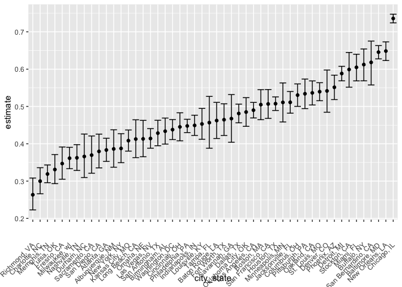
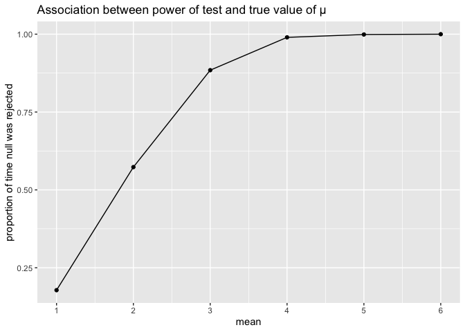
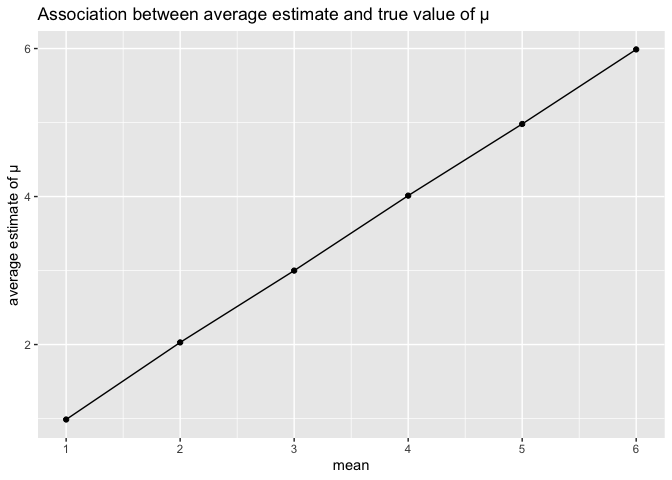
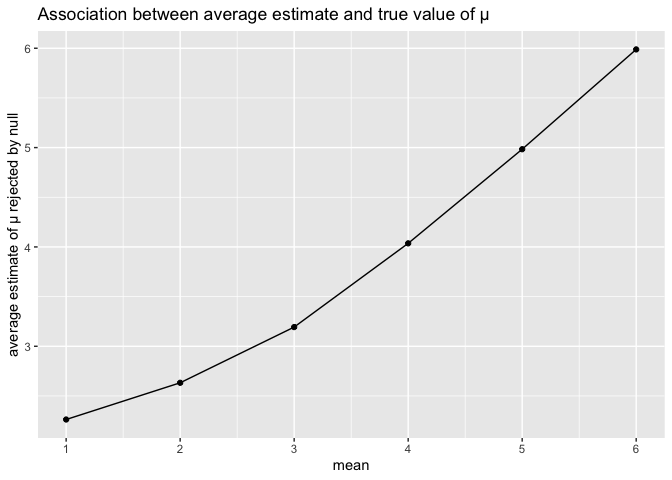

p8105_hw5_jy3186
================
Jiayi Yang
2022-11-10

## Problem 1

The code chunk below imports the data in individual spreadsheets
contained in `./data/zip_data/`. To do this, I create a dataframe that
includes the list of all files in that directory and the complete path
to each file. As a next step, I `map` over paths and import data using
the `read_csv` function. Finally, I `unnest` the result of `map`.

``` r
full_df = 
  tibble(
    files = list.files("data/zip_data/"),
    path = str_c("data/zip_data/", files)
  ) %>% 
  mutate(data = map(path, read_csv)) %>% 
  unnest()
```

    ## Rows: 1 Columns: 8
    ## ── Column specification ────────────────────────────────────────────────────────
    ## Delimiter: ","
    ## dbl (8): week_1, week_2, week_3, week_4, week_5, week_6, week_7, week_8
    ## 
    ## ℹ Use `spec()` to retrieve the full column specification for this data.
    ## ℹ Specify the column types or set `show_col_types = FALSE` to quiet this message.
    ## Rows: 1 Columns: 8
    ## ── Column specification ────────────────────────────────────────────────────────
    ## Delimiter: ","
    ## dbl (8): week_1, week_2, week_3, week_4, week_5, week_6, week_7, week_8
    ## 
    ## ℹ Use `spec()` to retrieve the full column specification for this data.
    ## ℹ Specify the column types or set `show_col_types = FALSE` to quiet this message.
    ## Rows: 1 Columns: 8
    ## ── Column specification ────────────────────────────────────────────────────────
    ## Delimiter: ","
    ## dbl (8): week_1, week_2, week_3, week_4, week_5, week_6, week_7, week_8
    ## 
    ## ℹ Use `spec()` to retrieve the full column specification for this data.
    ## ℹ Specify the column types or set `show_col_types = FALSE` to quiet this message.
    ## Rows: 1 Columns: 8
    ## ── Column specification ────────────────────────────────────────────────────────
    ## Delimiter: ","
    ## dbl (8): week_1, week_2, week_3, week_4, week_5, week_6, week_7, week_8
    ## 
    ## ℹ Use `spec()` to retrieve the full column specification for this data.
    ## ℹ Specify the column types or set `show_col_types = FALSE` to quiet this message.
    ## Rows: 1 Columns: 8
    ## ── Column specification ────────────────────────────────────────────────────────
    ## Delimiter: ","
    ## dbl (8): week_1, week_2, week_3, week_4, week_5, week_6, week_7, week_8
    ## 
    ## ℹ Use `spec()` to retrieve the full column specification for this data.
    ## ℹ Specify the column types or set `show_col_types = FALSE` to quiet this message.
    ## Rows: 1 Columns: 8
    ## ── Column specification ────────────────────────────────────────────────────────
    ## Delimiter: ","
    ## dbl (8): week_1, week_2, week_3, week_4, week_5, week_6, week_7, week_8
    ## 
    ## ℹ Use `spec()` to retrieve the full column specification for this data.
    ## ℹ Specify the column types or set `show_col_types = FALSE` to quiet this message.
    ## Rows: 1 Columns: 8
    ## ── Column specification ────────────────────────────────────────────────────────
    ## Delimiter: ","
    ## dbl (8): week_1, week_2, week_3, week_4, week_5, week_6, week_7, week_8
    ## 
    ## ℹ Use `spec()` to retrieve the full column specification for this data.
    ## ℹ Specify the column types or set `show_col_types = FALSE` to quiet this message.
    ## Rows: 1 Columns: 8
    ## ── Column specification ────────────────────────────────────────────────────────
    ## Delimiter: ","
    ## dbl (8): week_1, week_2, week_3, week_4, week_5, week_6, week_7, week_8
    ## 
    ## ℹ Use `spec()` to retrieve the full column specification for this data.
    ## ℹ Specify the column types or set `show_col_types = FALSE` to quiet this message.
    ## Rows: 1 Columns: 8
    ## ── Column specification ────────────────────────────────────────────────────────
    ## Delimiter: ","
    ## dbl (8): week_1, week_2, week_3, week_4, week_5, week_6, week_7, week_8
    ## 
    ## ℹ Use `spec()` to retrieve the full column specification for this data.
    ## ℹ Specify the column types or set `show_col_types = FALSE` to quiet this message.
    ## Rows: 1 Columns: 8
    ## ── Column specification ────────────────────────────────────────────────────────
    ## Delimiter: ","
    ## dbl (8): week_1, week_2, week_3, week_4, week_5, week_6, week_7, week_8
    ## 
    ## ℹ Use `spec()` to retrieve the full column specification for this data.
    ## ℹ Specify the column types or set `show_col_types = FALSE` to quiet this message.
    ## Rows: 1 Columns: 8
    ## ── Column specification ────────────────────────────────────────────────────────
    ## Delimiter: ","
    ## dbl (8): week_1, week_2, week_3, week_4, week_5, week_6, week_7, week_8
    ## 
    ## ℹ Use `spec()` to retrieve the full column specification for this data.
    ## ℹ Specify the column types or set `show_col_types = FALSE` to quiet this message.
    ## Rows: 1 Columns: 8
    ## ── Column specification ────────────────────────────────────────────────────────
    ## Delimiter: ","
    ## dbl (8): week_1, week_2, week_3, week_4, week_5, week_6, week_7, week_8
    ## 
    ## ℹ Use `spec()` to retrieve the full column specification for this data.
    ## ℹ Specify the column types or set `show_col_types = FALSE` to quiet this message.
    ## Rows: 1 Columns: 8
    ## ── Column specification ────────────────────────────────────────────────────────
    ## Delimiter: ","
    ## dbl (8): week_1, week_2, week_3, week_4, week_5, week_6, week_7, week_8
    ## 
    ## ℹ Use `spec()` to retrieve the full column specification for this data.
    ## ℹ Specify the column types or set `show_col_types = FALSE` to quiet this message.
    ## Rows: 1 Columns: 8
    ## ── Column specification ────────────────────────────────────────────────────────
    ## Delimiter: ","
    ## dbl (8): week_1, week_2, week_3, week_4, week_5, week_6, week_7, week_8
    ## 
    ## ℹ Use `spec()` to retrieve the full column specification for this data.
    ## ℹ Specify the column types or set `show_col_types = FALSE` to quiet this message.
    ## Rows: 1 Columns: 8
    ## ── Column specification ────────────────────────────────────────────────────────
    ## Delimiter: ","
    ## dbl (8): week_1, week_2, week_3, week_4, week_5, week_6, week_7, week_8
    ## 
    ## ℹ Use `spec()` to retrieve the full column specification for this data.
    ## ℹ Specify the column types or set `show_col_types = FALSE` to quiet this message.
    ## Rows: 1 Columns: 8
    ## ── Column specification ────────────────────────────────────────────────────────
    ## Delimiter: ","
    ## dbl (8): week_1, week_2, week_3, week_4, week_5, week_6, week_7, week_8
    ## 
    ## ℹ Use `spec()` to retrieve the full column specification for this data.
    ## ℹ Specify the column types or set `show_col_types = FALSE` to quiet this message.
    ## Rows: 1 Columns: 8
    ## ── Column specification ────────────────────────────────────────────────────────
    ## Delimiter: ","
    ## dbl (8): week_1, week_2, week_3, week_4, week_5, week_6, week_7, week_8
    ## 
    ## ℹ Use `spec()` to retrieve the full column specification for this data.
    ## ℹ Specify the column types or set `show_col_types = FALSE` to quiet this message.
    ## Rows: 1 Columns: 8
    ## ── Column specification ────────────────────────────────────────────────────────
    ## Delimiter: ","
    ## dbl (8): week_1, week_2, week_3, week_4, week_5, week_6, week_7, week_8
    ## 
    ## ℹ Use `spec()` to retrieve the full column specification for this data.
    ## ℹ Specify the column types or set `show_col_types = FALSE` to quiet this message.
    ## Rows: 1 Columns: 8
    ## ── Column specification ────────────────────────────────────────────────────────
    ## Delimiter: ","
    ## dbl (8): week_1, week_2, week_3, week_4, week_5, week_6, week_7, week_8
    ## 
    ## ℹ Use `spec()` to retrieve the full column specification for this data.
    ## ℹ Specify the column types or set `show_col_types = FALSE` to quiet this message.
    ## Rows: 1 Columns: 8
    ## ── Column specification ────────────────────────────────────────────────────────
    ## Delimiter: ","
    ## dbl (8): week_1, week_2, week_3, week_4, week_5, week_6, week_7, week_8
    ## 
    ## ℹ Use `spec()` to retrieve the full column specification for this data.
    ## ℹ Specify the column types or set `show_col_types = FALSE` to quiet this message.

    ## Warning: `cols` is now required when using unnest().
    ## Please use `cols = c(data)`

The result of the previous code chunk isn’t tidy – data are wide rather
than long, and some important variables are included as parts of others.
The code chunk below tides the data using string manipulations on the
file, converting from wide to long, and selecting relevant variables.

``` r
tidy_df = 
  full_df %>% 
  mutate(
    files = str_replace(files, ".csv", ""),
    group = str_sub(files, 1, 3)) %>% 
  pivot_longer(
    week_1:week_8,
    names_to = "week",
    values_to = "outcome",
    names_prefix = "week_") %>% 
  mutate(week = as.numeric(week)) %>% 
  select(group, subj = files, week, outcome)
```

Finally, the code chunk below creates a plot showing individual data,
faceted by group.

``` r
tidy_df %>% 
  ggplot(aes(x = week, y = outcome, group = subj, color = group)) + 
  geom_point() + 
  geom_path() + 
  facet_grid(~group)
```

<!-- -->

This plot suggests high within-subject correlation – subjects who start
above average end up above average, and those that start below average
end up below average. Subjects in the control group generally don’t
change over time, but those in the experiment group increase their
outcome in a roughly linear way.

## Problem 2

Import and tidy the dataset

``` r
homicide_df = 
  read_csv(url("https://github.com/washingtonpost/data-homicides/blob/master/homicide-data.csv?raw=true"))
```

Create a city_state variable (e.g. “Baltimore, MD”) and then summarize
within cities to obtain the total number of homicides and the number of
unsolved homicides (those for which the disposition is “Closed without
arrest” or “Open/No arrest”).

``` r
homicide_new =
homicide_df %>% 
  mutate(city_state = str_c(city, state, sep = ", ")) %>% 
  group_by(city_state)

homicide_count = 
  homicide_new %>% 
  group_by(city_state) %>% 
  summarize(homicide_total = n())

homicide_unsolved =
  homicide_new %>% 
  filter(disposition %in% c("Closed without arrest", "Open/No arrest")) %>% 
  group_by(city_state) %>% 
  summarize(unsolved_total = n())

homicide_table = 
  merge(homicide_count, homicide_unsolved, by = "city_state")

knitr::kable(homicide_table)
```

| city_state         | homicide_total | unsolved_total |
|:-------------------|---------------:|---------------:|
| Albuquerque, NM    |            378 |            146 |
| Atlanta, GA        |            973 |            373 |
| Baltimore, MD      |           2827 |           1825 |
| Baton Rouge, LA    |            424 |            196 |
| Birmingham, AL     |            800 |            347 |
| Boston, MA         |            614 |            310 |
| Buffalo, NY        |            521 |            319 |
| Charlotte, NC      |            687 |            206 |
| Chicago, IL        |           5535 |           4073 |
| Cincinnati, OH     |            694 |            309 |
| Columbus, OH       |           1084 |            575 |
| Dallas, TX         |           1567 |            754 |
| Denver, CO         |            312 |            169 |
| Detroit, MI        |           2519 |           1482 |
| Durham, NC         |            276 |            101 |
| Fort Worth, TX     |            549 |            255 |
| Fresno, CA         |            487 |            169 |
| Houston, TX        |           2942 |           1493 |
| Indianapolis, IN   |           1322 |            594 |
| Jacksonville, FL   |           1168 |            597 |
| Kansas City, MO    |           1190 |            486 |
| Las Vegas, NV      |           1381 |            572 |
| Long Beach, CA     |            378 |            156 |
| Los Angeles, CA    |           2257 |           1106 |
| Louisville, KY     |            576 |            261 |
| Memphis, TN        |           1514 |            483 |
| Miami, FL          |            744 |            450 |
| Milwaukee, wI      |           1115 |            403 |
| Minneapolis, MN    |            366 |            187 |
| Nashville, TN      |            767 |            278 |
| New Orleans, LA    |           1434 |            930 |
| New York, NY       |            627 |            243 |
| Oakland, CA        |            947 |            508 |
| Oklahoma City, OK  |            672 |            326 |
| Omaha, NE          |            409 |            169 |
| Philadelphia, PA   |           3037 |           1360 |
| Phoenix, AZ        |            914 |            504 |
| Pittsburgh, PA     |            631 |            337 |
| Richmond, VA       |            429 |            113 |
| Sacramento, CA     |            376 |            139 |
| San Antonio, TX    |            833 |            357 |
| San Bernardino, CA |            275 |            170 |
| San Diego, CA      |            461 |            175 |
| San Francisco, CA  |            663 |            336 |
| Savannah, GA       |            246 |            115 |
| St. Louis, MO      |           1677 |            905 |
| Stockton, CA       |            444 |            266 |
| Tampa, FL          |            208 |             95 |
| Tulsa, OK          |            583 |            193 |
| Washington, DC     |           1345 |            589 |

use the prop.test function to estimate the proportion of homicides that
are unsolved; save the output of prop.test as an R object, apply the
broom::tidy to this object and pull the estimated proportion and
confidence intervals from the resulting tidy dataframe

``` r
prop.test(
  x = homicide_unsolved %>% 
    filter(city_state == "Baltimore, MD") %>% 
    pull(unsolved_total),
  n = homicide_count %>% 
    filter(city_state == "Baltimore, MD") %>% 
    pull(homicide_total)
  )%>% 
    broom::tidy()
```

    ## # A tibble: 1 × 8
    ##   estimate statistic  p.value parameter conf.low conf.high method        alter…¹
    ##      <dbl>     <dbl>    <dbl>     <int>    <dbl>     <dbl> <chr>         <chr>  
    ## 1    0.646      239. 6.46e-54         1    0.628     0.663 1-sample pro… two.si…
    ## # … with abbreviated variable name ¹​alternative

Now run prop.test for each of the cities in your dataset, and extract
both the proportion of unsolved homicides and the confidence interval
for each. Using mapping.

``` r
homicide_map = 
  homicide_table %>% 
  mutate(
    prop = map2(.x = unsolved_total, .y = homicide_total, ~prop.test(x=.x, n =.y)),
    clean = map(.x = prop, ~broom::tidy(.x)) 
  ) %>% 
  unnest(clean) %>% 
  select(city_state, estimate, conf.low, conf.high)
```

Create a plot that shows the estimates and CIs for each city, check out
geom_errorbar for a way to add error bars

``` r
homicide_plot = 
  homicide_map %>% 
  mutate(
    city_state =  fct_reorder(city_state, estimate)) %>% 
  ggplot(aes(x = city_state, y = estimate)) + geom_point() +
  geom_errorbar(aes(ymin = conf.low, ymax = conf.high)) +
      theme(axis.text.x = element_text(angle = 45, vjust = 0.6, hjust = 1), 
            legend.position = "bottom")

homicide_plot
```

<!-- -->

## Problem 3

First set the following design elements: Fix n=30 Fix σ=5 Set μ=0. write
a t-test function, with broom::tidy to obtain estimate and p-value

``` r
set.seed(0)
n =30
mu =0
sigma =5
x = rnorm(n, mean = mu, sd = sigma)
t.test(x, mu = mu, conf.level=0.95)
```

    ## 
    ##  One Sample t-test
    ## 
    ## data:  x
    ## t = 0.13152, df = 29, p-value = 0.8963
    ## alternative hypothesis: true mean is not equal to 0
    ## 95 percent confidence interval:
    ##  -1.596972  1.816480
    ## sample estimates:
    ## mean of x 
    ## 0.1097539

``` r
sim_test = function(n, mu = 0, sigma =5){
    x = rnorm(n, mean = mu, sd = sigma)
    t_test = t.test(x, conf.int = 0.95) %>% broom::tidy()
    t_test
}
```

Generate 5000 datasets from the model

``` r
sim_results_df = 
  expand_grid(
    sample_size = 30,
    iter = 1:5000
  ) %>% 
  mutate(
    estimate_df = map(sample_size, sim_test)
  ) %>% 
  unnest(estimate_df)
```

and repeat with mu = 1,2,3,4,5,6

``` r
sim_results = 
tibble(
  mu = c(1,2,3,4,5,6)
) %>% 
  mutate(
    output_list = map(.x = mu, ~rerun(5000, sim_test(n, mu = .x, sigma))),
    estimate_df = map(output_list, bind_rows)
  ) %>% 
  select(-output_list) %>% 
  unnest(estimate_df)
```

Make a plot showing the proportion of times the null was rejected (the
power of the test) on the y axis and the true value of μ on the x axis.
Describe the association between effect size and power.

``` r
sim_plot_1 = 
  sim_results %>% 
  filter(p.value < 0.05) %>% 
  group_by(mu) %>% 
  summarize(
    reject = n()
  ) %>% 
  mutate(
    proportion = reject/5000
  ) %>% 
  ggplot(aes(x = mu, y = proportion)) + geom_line() +
  geom_point() + scale_x_continuous(limits = c(1,6), breaks = seq(1,6,1)) +
    labs(
    title = "Association between power of test and true value of μ",
    x = "mean",
    y = "proportion of time null was rejected"
  )
sim_plot_1
```

<!-- -->

`As the mean of sample gets larger, the power of the test gets larger`

Make a plot showing the average estimate of μ̂ on the y axis and the true
value of μ on the x axis.

``` r
sim_plot_2 = 
  sim_results %>% 
  group_by(mu) %>% 
  summarize(average_est = mean(estimate)) %>% 
  ggplot(aes(x = mu, y = average_est), color = mu) + geom_line() +
  geom_point() + scale_x_continuous(limits = c(1,6), breaks = seq(1,6,1)) +
  labs(
    title = "Association between average estimate and true value of μ",
    x = "mean",
    y = "average estimate of μ"
  )

sim_plot_2
```

<!-- -->
Make a second plot (or overlay on the first) the average estimate of μ̂
only in samples for which the null was rejected on the y axis and the
true value of μ on the x axis.

``` r
sim_plot_3 =
  sim_results %>% 
  filter(p.value < 0.05) %>% 
  group_by(mu) %>% 
  summarize(
    average_est_rej = mean(estimate)
  ) %>% 
  ggplot(aes(x = mu, y = average_est_rej), color = mu) + geom_line() +
  geom_point() + scale_x_continuous(limits = c(1,6), breaks = seq(1,6,1)) +
  labs(
    title = "Association between average estimate and true value of μ",
    x = "mean",
    y = "average estimate of μ rejected by null"
  )

sim_plot_3
```

<!-- -->

Is the sample average of μ̂ across tests for which the null is rejected
approximately equal to the true value of μ? Why or why not? The sample
average of mu is approximately equal to the true value of mu, because
when we have a large effect size(move further away from the null value
of 0), we will have an approximately closely to the true mean. \*As the
effect size gets bigger, the power gets bigger.
